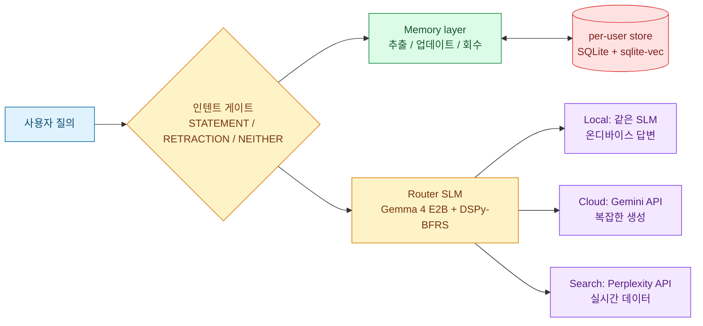

<!-- ABOUTME: 한국어 공개 진입점. 온디바이스 SLM 라우팅 분류기를 DSPy로 최적화한 개인 연구. -->
<!-- ABOUTME: 동기 → 파이프라인 → 태스크/데이터셋 → Router DSPy 결과 → 기술 스택. -->

# Multi-Agent-Project

> **TL;DR.** 온디바이스 SLM (Gemma 4 E2B) 의 라우팅 프롬프트를 DSPy 로
> 최적화해, **31B 레퍼런스 대비 −1.19 pp** (95.99% vs 97.18% test weighted F1)
> 까지 따라붙였습니다. 600개 hold-out 셋 기준, privacy leak 0건.

---

## 0. 프로젝트 동기

갤럭시 스마트폰에 Multi-Agent 시스템을 올리는 방향을 개인적으로 탐구한 프로젝트
입니다. **온디바이스 SLM(Small Language Model) 을 DSPy 로 최적화해 라우팅
분류기**로 사용하고, 메모리 시스템도 마찬가지로 구현하여, 챗봇을 만드는게
목표입니다.

이 프로젝트의 핵심 질문: **DSPy 로 작은 0.8B, 2B 모델을 31B 레퍼런스 모델
수준의 라우팅 품질에 얼마나 가깝게 끌어올릴 수 있는가?** — 그리고 같은
질문을 라우팅 너머 **메모리 파이프라인 (추출 / 업데이트 / 인텐트 / 회수)
4 가지 결정에도 확장 가능한가?** §3 가 첫 번째 질문의 답, §4 가 두 번째
질문의 진행 중인 답입니다.

---

## 1. 파이프라인



라우팅 분류기는 사용자 질의를 **Local / Cloud / Search** 세 가지로
분류합니다 (§3). 같은 SLM 이 동시에 메모리 layer 도 처리합니다 — STATEMENT
인지 RETRACTION 인지 NEITHER 인지를 *인텐트 게이트* 가 가르고, STATEMENT
면 추출+업데이트, RETRACTION 이면 회수+삭제로 분기 (§4). DSPy 의
`BootstrapFewShotWithRandomSearch` (BFRS), MIPROv2, COPRO 를 이용해
Gemini 3 Flash 로 생성한 데이터셋으로 최적화합니다.

---

## 2. 태스크 & 데이터셋 선정

### 2.1 라우팅 태스크 정의

사용자 질의 → **Local / Cloud / Search** 3-class single-label classification.

| 클래스 | 정의 | 예시 |
|---|---|---|
| **Local** | Galaxy 내장 앱 (Weather, Calendar, Samsung Health 등) 또는 온디바이스 SLM 이 직접 처리 가능. 캐주얼 대화 + 단순 Q&A + 개인·민감 정보 | "오늘 날씨", "hello 번역해줘", "내 부채 예산 짜줘" |
| **Cloud** | 큰 LLM 이 필요한 복잡 생성. 긴 글쓰기, 코드 생성, 다단계 추론 | "리액트 풀스택 todo 앱 작성", "이 3페이지 문서 번역" |
| **Search** | 실시간 외부 데이터 — 뉴스, 가격, 리뷰, 일정 정보 | "오늘 비트코인 가격", "다음 주 도쿄 날씨 예보" |

태스크의 어려움은 **같은 도메인 내 의도 판별** 에 있습니다 — "날씨" 는
Local (Galaxy Weather 앱) 이지만 "다음 주 도쿄 날씨" 는 Search; "hello
번역" 은 Local 이지만 "3페이지 문서 번역" 은 Cloud. 이 경계는 키워드만
보고는 잡히지 않아서 작은 모델에 특히 까다롭습니다.

### 2.2 데이터셋: train / val / test 의 세 자리

현재 production 세팅 (v4) 의 split 입니다.

| 자리 | 파일 | 크기 | 출처 | 누가 보는가 |
|---|---|---|---|---|
| **Train** | `seed_set.jsonl` | 150 | 손으로 큐레이션, 4-tier 난이도 균형 | DSPy 옵티마이저 (few-shot bootstrapping 의 풀) |
| **Val** | `val.jsonl` | 600 | Gemini 3 Flash 생성 (Galaxy 컨텍스트) | DSPy 옵티마이저가 candidate 마다 score 매겨 best 선택 |
| **Test** | `test.jsonl` | 600 | Gemini 3 Flash 생성 (Galaxy 컨텍스트) | **`evaluate.py` 만**. 옵티마이저는 한 번도 노출 안 됨 |

**Train 자리의 시드셋 (150)** 이 핵심 디자인 결정입니다. privacy-sensitive
생성 질의, 도메인 모호 질의, 키워드-orthogonal 의도 등 의도적으로 어려운
케이스를 박아 넣어, 작은 모델에서도 robust 한 프롬프트가 강제로 나오도록
설계. 초기 v3 에서는 이 자리에 합성 4800 (`train.jsonl`, Gemini 가 만든
6000 의 80% split) 을 썼지만 시드셋으로 바꾼 뒤 hold-out test 점수가 더
좋아져 v4 부터 시드셋으로 고정. **합성 4800 (train split) 은 현재 세팅에서
사용되지 않습니다.**

**Val / Test 600+600** 은 Gemini 3 Flash 합성셋의 10% / 10% split.
test 셋은 학습/검증 어디에도 노출되지 않은 진짜 hold-out 입니다 — 아래
§3.3 의 모든 점수는 이 셋 기준.

### 2.3 메트릭

DSPy 옵티마이저가 최대화하는 score:

```
score = (예측 라벨 == 정답 ? 1.0 : 0.0)  −  0.5 × (privacy-sensitive 질의를 Cloud 로 보냈는가)
```

프라이버시 패널티는 의도적인 트레이드오프입니다 — "내 $50,000 부채 예산
짜줘" 는 생성 품질 측면에서는 Cloud 가 유리하지만 개인 재무 정보가 외부로
나갑니다. 메트릭이 −0.5 로 직접 페널라이즈해서 라우터가 일부러 Local /
온디바이스를 선택하도록 유도.

---

## 3. Router DSPy 최적화

### 3.1 왜 DSPy 인가

손으로 짠 프롬프트는 모델/도메인이 바뀌면 drift 합니다. DSPy 는 **시그니처 (입력/출력 스키마) 만 선언** 하면 옵티마이저가 인스트럭션 + few-shot 데모를 자동 탐색해서 메트릭을 최대화하는 프롬프트를 빌드합니다. 결과물은 선언적 시그니처 + 학습된 상태 (`.json`) 로 저장되어 프로덕션에서 그대로 로드하여 **프롬프트가 코드와 함께 버전 관리되는 자산** 이 됩니다.

### 3.2 옵티마이저 비교

같은 시드셋 + 같은 메트릭에 세 옵티마이저 적용:

| 옵티마이저 | 학습 대상 | 탐색 방식 |
|---|---|---|
| **MIPROv2** | 인스트럭션 + few-shot 데모 | Bayesian 동시 최적화 |
| **BFRS** (BootstrapFewShotWithRandomSearch) | few-shot 데모만 | Random search; 인스트럭션 fixed |
| **COPRO** | 인스트럭션 prose 만 | LLM 이 prose 를 반복 rewrite |

**Validation weighted F1** (`val.jsonl` 600개, §2.2 참조):

| 모델 | Baseline | MIPROv2 | BFRS | COPRO |
|---|---|---|---|---|
| Gemma 4 31B (레퍼런스) | — | **88.37%** | — | — |
| Gemma 4 E2B (5.12B) | 81.80% | 85.18% | **86.25%** | 84.63% |
| Qwen 3.5 0.8B (873M) | 63.92% | 72.05% | **80.78%** | 73.50% |

**관찰**: 작은 모델일수록 BFRS 가 MIPROv2 를 더 크게 이김 (Qwen 에서 +8.7
pp). 추가로 cross-ablation 을 돌렸습니다 — BFRS 가 고른 데모를 MIPROv2 가
쓴 인스트럭션과 결합, 그리고 그 반대 — 결과는 **차이의 원인이 데모 선택**
이지 인스트럭션 rewriting 이 아니라는 것이었습니다. MIPROv2 의 Bayesian
탐색이 instruction × demo 결합 공간에서 demo 측 시그널을 약하게 봅니다.

또 한 가지 — **COPRO 는 SLM 에서 약했습니다.** COPRO 는 인스트럭션을 LLM
이 verbosely rewrite 하는데, 작은 모델은 긴 prose 인스트럭션을 잘 못 따라
갑니다. Qwen 에서 COPRO 73.50% < BFRS 80.78% 가 그 증거.

### 3.3 Hold-out 테스트 결과

**학습 시 한 번도 노출되지 않은** `test.jsonl` 600개 기준 weighted F1:

| 모델 | 옵티마이저 | Test Weighted F1 | Privacy leak |
|-------|-----------|------------------|--------------|
| Gemma 4 31B (레퍼런스) | MIPROv2 | **97.18%** | 0/11 (0.0%) |
| **Gemma 4 E2B (production)** | **BFRS** | **95.99%** | **0/11 (0.0%)** |
| Qwen 3.5 0.8B | BFRS | 87.76% | 0/11 (0.0%, §3.4 참조) |

> **핵심 결과**: Gemma 4 E2B + BFRS 는 31B 레퍼런스 대비 **−1.19 pp** —
> 2B급 모델이 31B 와 사실상 동급의 라우팅 품질을 hold-out 에서
> 보였습니다.

per-class 혼동행렬, 모델별 latency 분포, 에러 분석 산출물은 모두
`research/results/` 에 PNG / JSON 으로 함께 들어 있습니다 — Stage 별
recompute 없이 그대로 비교 가능합니다.

### 3.4 Privacy leak 측정 도구의 결함

위 표의 Qwen 행은 처음에 **18.2% (2/11) privacy leak** 으로 잡혔던 셋
입니다. 두 양성 샘플을 직접 들여다본 결과는 다음과 같았습니다:

- 두 양성 샘플 모두 **정답 라벨이 `search`** 였고 실제 민감 개인 정보는
  없었음.
- 측정 도구 `is_privacy_sensitive()` 가 flat substring 스캐너여서,
  **"my health profile"** (Galaxy Health 앱의 정식 메뉴 명칭) 과
  **"social security trust fund"** (미국 공공 프로그램 이름) 을 false
  positive 로 잡았음.

→ **실제 privacy leak 은 0/11**. 측정 도구를 LLM-as-judge 로 대체하는 게
backlog 입니다. flat substring 패턴이 production 메트릭으로는 부족하다는
점이 이 조사의 가장 큰 교훈이었습니다.

### 3.5 재현하기

```bash
# Production 디폴트로 평가 (Gemma 4 E2B + BFRS, 95.99% F1)
python research/evaluate.py

# 직접 다시 최적화 (수 시간 소요, Ollama 2 인스턴스 필요)
python research/dspy_optimizer.py --model gemma4:e2b --seed-set --auto light \
  --task-base http://127.0.0.1:11435 \
  --prompt-model gemma4:31b --prompt-base http://127.0.0.1:11434
```

위 명령은 **task model (E2B)** 은 GPU 2 의 Ollama 인스턴스, **proposer
(31B)** 는 GPU 1 의 Ollama 인스턴스에 올리는 셋업을 가정합니다 — 같은
인스턴스에 두 모델을 올리면 DSPy 가 직렬 큐에 걸려 timeout 이 납니다.

Production 아티팩트: `research/artifacts/optimized_router_state_gemma4_e2b_bfrs.json` - 이 한 파일이 95.99% F1 라우터 그 자체.

---

## 4. Memory DSPy 최적화

> **이 repo 의 self-contained 범위에 관한 주의.** 이 repository 는
> source repo `LLM-as-router` 의 큐레이션된 공개 mirror 입니다.
> **§3 라우터 작업의 코드 / artifact / tests 는 이 repo 만으로 재현
> 가능** 하지만, **§4 의 메모리 코드 / `research/artifacts/optimized_memory_*`
> / `tests/test_memory_store_state_harness.py` / `requirements.txt` 의
> LangChain·sqlite-vec·pytest 의존성 은 mirror 동기화 대기 중이며
> 현재 source repo 에만 존재** 합니다. §4 의 인용 파일 경로와 §4.5
> 재현 명령은 source repo (`LLM-as-router`) 기준으로 읽어주세요 — 다음
> sync 사이클에 mirror 에도 들어옵니다.

라우터를 만들고 나서 곧바로 부딪힌 질문: **개인 정보를 기억하는 챗봇**
을 만들려면 메모리 파이프라인이 필요한데, 메모리 결정은 라우터 분류
보다 본질적으로 더 복잡합니다. 라우터는 한 메시지 → 한 라벨이지만,
메모리는 한 메시지 → 0-N 개의 추출된 fact + 각 fact 마다 4-class 결정
(추가 / 수정 / 삭제 / 무시) + 추가로 *그 메시지가 메모리 관련 의도인지
잡담인지* 까지. 이를 *하나의 LM 호출* 로 묶으려는 초기 시도는 실패했고
(§4.1 참조), 결국 **결정을 4 개로 분해해 각각 DSPy 로 최적화** 하는
접근으로 수렴했습니다.

### 4.1 라우터와 다른 점 — 왜 결정이 4 개로 쪼개졌나

| 결정 | 입력 | 출력 | 결정 cardinality |
|---|---|---|---|
| `ExtractMemoryFacts` | 사용자 메시지 | candidate fact 의 *리스트* | 가변 (0-N) |
| `UpdateMemoryDecision` | fact 1 개 + 기존 유사 메모리 | `ADD / UPDATE / DELETE / NOOP` | fact 마다 1 개 |
| `DetectMemoryIntent` | 메시지 + 최근 대화 | `STATEMENT / RETRACTION / NEITHER` | 메시지마다 1 개 |
| `RetractionDecide` | 메시지 + 유사 메모리 | 삭제 대상 ID *리스트* | 가변 (0-N) |

(위 §1 다이어그램에서 *인텐트 게이트* 는 메모리 layer 의 첫 동작이지만
모든 메시지마다 가장 먼저 호출되어 후속 흐름을 결정하기 때문에 시각적으로
별도 박스로 그려져 있습니다 — 본질은 메모리 layer 의 4 결정 중 첫 번째.)

처음에는 1 개의 LM 호출로 모두 처리하려 했습니다. 같은 prompt 가
"이 메시지에서 메모리 관련 의도를 다 처리하라" — 추출도, 업데이트도,
인텐트 분류도, 회수도. **결정 cardinality 가 다른** 4 가지를 묶으려니
LM 이 fact 개수와 update 결정 개수를 *동기화* 해야 했고 그게 안
됐습니다. 실패 모드: fact 를 3 개 뽑고 update 결정은 1 개만 출력. 또는
update 결정 4 개 출력 (실제 fact 는 2 개).

분해 이후 각 결정을 별도 DSPy 시그니처로 정의하고 BFRS 로 따로 학습.
**Cardinality 가 깨질 일이 없음** — 추출의 출력 길이가 N 이면 N 번
update 호출, 끝. 추가로 인텐트 게이트와 회수를 분리한 이유는 *전체
context scope 가 다르기* 때문 — 인텐트는 대화 전체를 보고, 회수는
"회수하기로 정해진 뒤" 어느 row 를 지울지만 봅니다.

이 4 개의 결정 prompt 가 모두 `research/artifacts/optimized_memory_*_gemma4_e2b_bfrs.json`
에 BFRS 최적화 산출물로 들어 있습니다 — 라우터 artifact 와 동일한
포맷, 동일한 BFRS 옵티마이저로.

### 4.2 NOOP boundary — 잡담을 메모리로 만들지 않기

`NOOP` 은 4 op 중 하나지만 *나머지 셋 모두에 영향* 을 주는 op 입니다.
"오늘 날씨 어때?" 같은 잡담이 들어왔을 때 *추출이 빈 list 를 반환* 하면
update 가 호출조차 안 되어 안전하지만, 추출이 무관한 잡음을 fact 로
잘못 뽑은 경우에는 update 가 그걸 잡아 `NOOP` 으로 거부해야 메모리가
지저분해지지 않습니다.

production 측 정량 지표 두 가지:

- **`transient_noise_rate`** — 잡담이 메모리에 fact 로 저장되는 비율.
- **`duplicate_rate`** — 이미 있는 fact 가 또 저장되는 비율.

두 지표 모두 0 이어야 NOOP boundary 가 견고. 이것을 정확히 맞추는 것이
워낙 까다로워서 **NOOP instruction 재학습 자체가 한 stage** 였습니다.
5 개 candidate (A-E) 중 두 가지 hold-out 테스트 — *정정 정확도 테스트*
(corrected probe, 정정 발화 10 개에 대한 응답 정확도) + *NOOP 경계 테스트*
(boundary probe, 잡담 12 개를 NOOP 으로 인식하는지) — 를 모두 통과한 A 만
채택. A 의 validation 점수가 95.14% — 다른 후보 (MIPROv2 기반) 는 점수가
97.57% 로 더 높았지만 정정 정확도가 8/10 으로 떨어져 탈락.
**단순함이 점수보다 견고했습니다.**

production prompt md5: `74fada6369759686198400d5e24f2632`.

### 4.3 Live store-state harness — production 측정의 충격

라우터 §3 에서는 hold-out test 셋 600 개의 weighted F1 만 봐도 진척이
충분히 측정됐습니다. 메모리는 같은 방식으로 측정이 안 됩니다 — 한
turn 의 점수만으로는 *대화가 진행되면서 store 의 row 들이 어떻게
변하는지* 를 못 봅니다.

그래서 **store-state harness** 를 도입 — 총 25 개의 multi-turn 시나리오를
6 개 tier (단순 정정 / 복합 정정 / 시간 경과 / 중복 / 잡담 / 회수) 에
분배. 시나리오 1 회 실행 시 합계 65 turns 이고, `HARNESS_REPS=3` 으로
세 번 반복해 총 195 turns 측정. 매 turn 마다 store 의 row 들을 검사하고
**paraphrase 인식 LLM-as-judge (31B Gemma, 3-rep 다수결)** 가 정답
스크립트와 일치하는지 판정. 단순 string compare 가 못 잡는 의미 동치
(*"User is a Yonsei professor"* vs *"The user works at Yonsei University
as faculty"*) 를 LM 이 vote.

production setup (Gemma 4 E2B + 모든 BFRS artifact) 의 baseline:

| Tier | correction_success_rate | stale_row_rate | verdict |
|---|---:|---:|---|
| transient_noise | **100%** | 0% | PASS |
| duplicate | **100%** | 0% | PASS |
| simple_correction | 62.5% | 25% | FAIL |
| compound_correction | 60.0% | 13% | FAIL |
| longitudinal | 52.9% | 17% | FAIL |
| retraction | **22.2%** | 40% | FAIL (최하) |
| **headline** | **54.2%** | 17.9% | — |

`transient_noise` 와 `duplicate` 가 **100% PASS** 인 것이 §4.2 의 NOOP
boundary 작업의 직접적 결과 — 잡담은 메모리에 안 들어가고, 중복은 또
저장 안 됨. 반면 correction / retraction tier 가 모두 FAIL — 메모리는
"새로 저장" 보다 "이미 있는 것을 정정 / 회수" 가 본질적으로 더 어렵
습니다.

### 4.4 Lever decision — 어디를 손봐야 가장 효과 큰가 (진행 중)

문제: retraction 22% 의 *원인이 무엇인가*. 모델 capacity 한계? Prompt
의 demos 가 잘못 가르치고 있나? 파이프라인 구조 자체가 부족한가? 이걸
가르려면 **counterfactual 측정** 이 필요합니다. 같은 harness 로 두
reference config 를 더 측정:

1. **demo ablation** — 현재 production prompt 의 few-shot 데모만 zero
   out, instruction 그대로. (`MEMORY_UPDATE_DEMO_ABLATION=1` 환경 변수.)
2. **31B executor swap** — 같은 BFRS artifact 를 31B 모델이 실행.
   (`MEMORY_EXECUTOR_MODEL=gemma4:31b`.)

3-config delta (correction_success_rate):

| Tier | Baseline (E2B) | Demo ablation (E2B) | 31B exec swap |
|---|---:|---:|---:|
| **retraction** | **22.2%** | **66.7% (+44.4pp)** | **66.7% (+44.4pp)** |
| longitudinal | 52.9% | 41.2% (−11.8pp) | **80.4% (+27.5pp)** |
| compound_correction | 60.0% | 76.7% (+16.7pp) | 53.3% (−6.7pp) |
| simple_correction | 62.5% | 50.0% (−12.5pp) | 62.5% (0.0pp) |
| transient_noise | 100% | 100% | 100% |
| duplicate | 100% | 100% | 100% |
| **headline** | **54.2%** | 59.7% (+5.6pp) | **70.8% (+16.7pp)** |

핵심 관찰: **retraction tier 에서 demo ablation 과 31B swap 이 정확히
같은 +44.4pp.** 두 다른 매커니즘 (demos 제거 / capacity 증대) 이 같은
ceiling 에 도달했다는 것은, *capacity 단독으로는* retraction 을 못
끌어올린다는 뜻 — capacity 가 진짜 lever 라면 31B 가 demo ablation 보다
*더 위* 로 올라가야 합니다. 동일하다는 것은 **demos 가 retraction 에서
잘못된 방향으로 LM 을 이끌고 있고**, demos 제거든 capacity 증대든 둘 다
*demos 영향력을 무력화* 하는 두 다른 path 라는 해석.

이 한 관찰로 다음 작업 (Stage 23) 의 lever 가 결정됨:

- **1순위: demo regeneration.** 현 BFRS demos 가 retraction 시나리오에서
  발목 잡고 있다는 직접 증거. 다만 demo ablation 이 simple/longitudinal
  에서 regress 했으므로 *단순 zero-out 은 안 되고* selective curation
  필요.
- **2순위: 더 큰 모델로 swap.** longitudinal 의 +27.5pp 는 진짜 capacity
  이득이지만 retraction 이득은 demo 효과와 구분 불가. on-device 내러티
  브가 약화되므로 lever 1 결과를 보고 결정.

[디테일은 source repo 의 `docs/stage_22b/reference_configs.md` 에 정리되어
있습니다 — mirror sync 이후 이 repo 의 `docs/` 에도 동기화 예정.]

### 4.5 재현하기

> 아래 명령과 경로는 모두 **source repo `LLM-as-router` 기준** 입니다
> (mirror 동기화 대기 중 — §4 도입부 주의 참고). source repo 가 로컬에
> clone 되어 있다고 가정.

```bash
# source repo 루트로 이동
cd $LLM_ROUTER_ROOT   # e.g. /workspace/projects/LLM-as-router

# Harness 실행 (live backend + 31B judge 필요, 약 40 분 — GPU 두 장 가정)
# pytest 는 source repo 의 requirements 에 포함되어 있음.
BACKEND_URL=http://127.0.0.1:8002 \
ROUTER_API_KEY=dev-key \
JUDGE_OLLAMA_URL=http://127.0.0.1:11434 \
JUDGE_MODEL=gemma4:31b \
HARNESS_TAG=local_repro \
HARNESS_REPS=3 \
$HOME/micromamba/envs/llm_router/bin/python -m pytest -m harness \
  tests/test_memory_store_state_harness.py -s
```

Production 메모리 artifacts (모두 source repo 의 `research/artifacts/`):

- `optimized_memory_extract_gemma4_e2b_bfrs.json` — Extract (Stage
  10.2 BFRS)
- `optimized_memory_update_gemma4_e2b_bfrs.json` — Update (Stage 20 A
  BFRS, prompt md5 `74fada63...`)
- `optimized_memory_intent_gemma4_e2b_bfrs.json` — Intent gate (Stage
  11.1-11.2 BFRS)
- `optimized_memory_retract_gemma4_e2b_bfrs.json` — RetractionDecide
  (Stage 11.3 BFRS)

---

## 기술 스택

- **레퍼런스 / 티처 모델**: Gemma 4 31B via Ollama — F1 ceiling 레퍼런스 + DSPy proposer 양쪽으로 사용
- **온디바이스 SLM**: Gemma 4 E2B (5.12B, production), Qwen 3.5 0.8B (873M, 비교용)
- **DSPy 옵티마이저**: `BootstrapFewShotWithRandomSearch` (BFRS) — 라우터 + 메모리 4 결정 (Extract / Update / Intent / Retract) 모두 같은 옵티마이저로 학습. §3.2 ablation 에서 MIPROv2 / COPRO 와 비교 후 채택
- **Runtime**: LangChain LCEL + `ChatOllama(cache=False)` async (Stage 17 이후 — DSPy 는 offline 최적화 전용, runtime 에는 들어가지 않음)
- **메모리 storage**: SQLite + `sqlite-vec` (per-user isolation), BGE-small 384-d 임베더
- **라우터 평가**: 600 큐레이션 hold-out 셋, weighted F1 + privacy leak rate
- **메모리 평가**: store-state harness (25 시나리오를 6 tier 에 분배, 시나리오 1 회 실행 시 65 turns × `HARNESS_REPS=3` = 195 turns, `pytest -m harness`) + 31B paraphrase-aware LLM-as-judge. *현재 mirror 미동기화 — source repo 에서만 실행 가능 (§4 도입부 주의 참고).*
- **Python**: 3.11 (micromamba)

---

## 라이선스

Apache 2.0 — `LICENSE` 참조.
